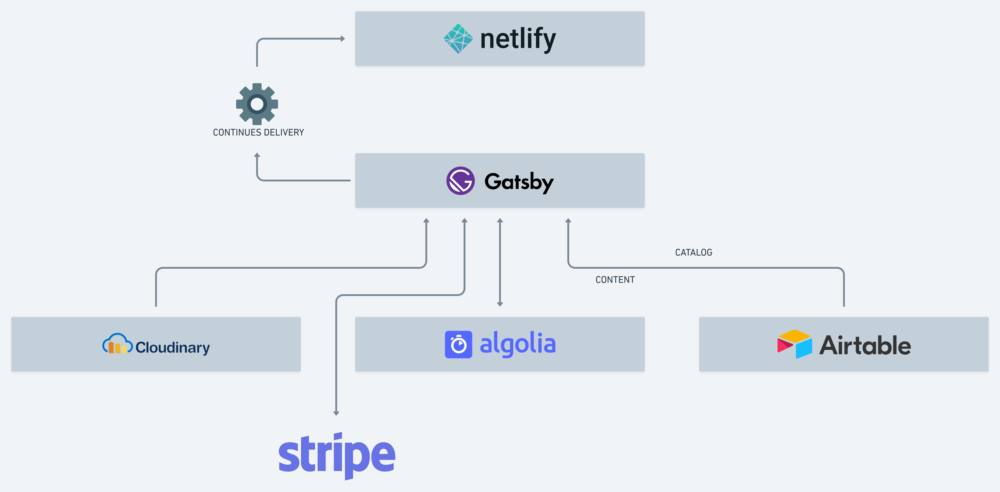

# Myjam Store

A marketplace for exotic grocery.

The project is open source and built on the JAM Stack using the following technologies:

- [Netlify](https://www.netlify.com/) for hosting.
- [Airtable](https://airtable.com/) for products.
- [Cloudinary](https://cloudinary.com/) for images.
- [Stripe](https://stripe.com/) for cart and checkout.
- [Algolia](https://www.algolia.com/) for search.

Our plan and performance can be found [here](https://www.notion.so/Myjam-Playbook-d0f0c790fd2649c589bb256be168c445).

